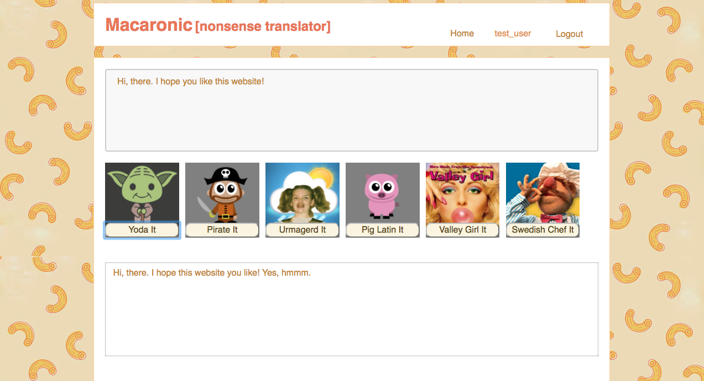

# macaronic 

Merriam-Webster.com: 

"1:  characterized by a mixture of vernacular words with Latin words or with non-Latin words having Latin endings
2:  characterized by a mixture of two languages"

Currently using the Yodaspeak API.

##screenshot
 